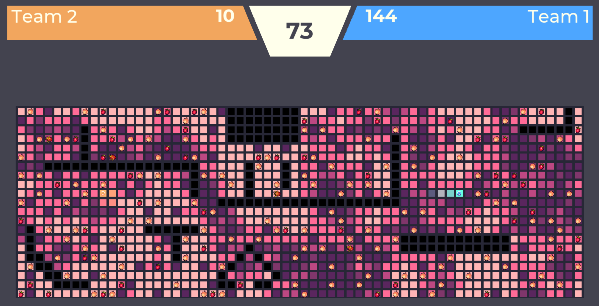
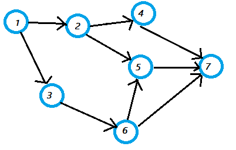
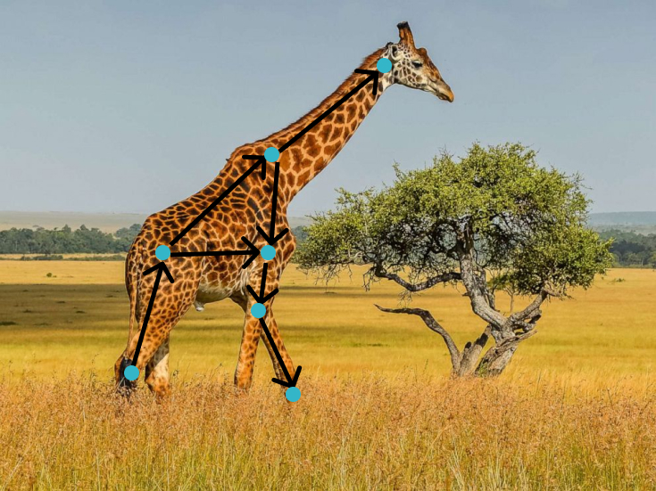

# Directed Acyclic Giraffe

[AI Arena 2021](http://monashicpc.com/aiarena) Bot - 1st Place! 🥇



## How to run

(instructions using pip3 / python3 as commands, replace with pip/python if that's what you have installed)

```bash
pip3 install ai-arena-21
aiarena21 the_giraffe_himself the_giraffe_himself
```

The file 'the_giraffe_himself.py' contains our final bot submission, which won thanks to pretty decent bidding and pathfinding abilities, as well as strong ability to make the most of the bicycle powerup. This was in spite of occasionally wasting all its money on portal guns - with hilarity ensuing for everyone watching the finals. It has not been modified since the competition and should not be used as an example of general code cleanliness :)

All other bots we experimented with, many of which share characteristics with the final submission, can be found in the 'experimental_bots/' folder.

Competition instructions and info are in the instruction document provided (docs/DocV1.pdf)

### What's with the name?

This is a directed acyclic graph:



This is a giraffe:


And here is a world-first image detailing the combination of the two, the Directed Acyclic Giraffe:



The grand final ended up being between us and another bot called 'correct horse battery staple' ([XKCD reference](https://xkcd.com/936/)), so it was a battle of the mammals 🐴 🦒
